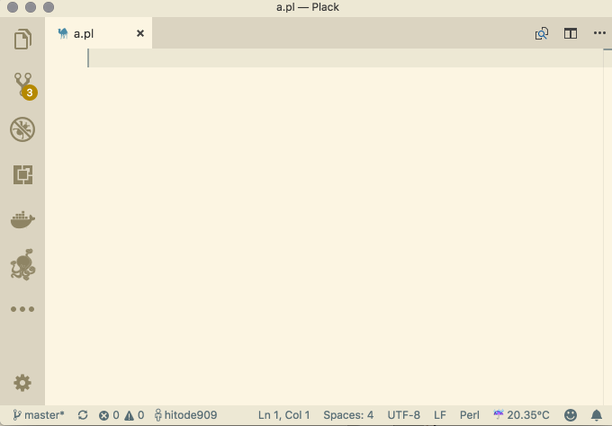

# vscode-auto-programming package

Provide statistical complements for git project.

VSCode port of [emacs-auto-programming](https://github.com/hitode909/emacs-auto-programming) and [atom-auto-programming](https://github.com/hitode909/atom-auto-programming).



## How To Use

Write some code and run `AutoProgramming: complement` manually.
You will get candidates of next line of the code.

For example, when you type `use stri`, the code you want to get is `use strict;`, and the next line is `use warnings`.

`vscode-auto-programming` runs `git grep 'use stri'` internally, collect result, and sort by appear count.

## Requirements

- Supports git projects.
- Supports any languages.

## Invoke via Keyboard Shortcut

To invoke via shortcut keys, Set the code below at keybindings.json.

```json
{
    "key": "alt+;",
    "command": "autoProgramming.complement",
    "when": "editorTextFocus"
}
```